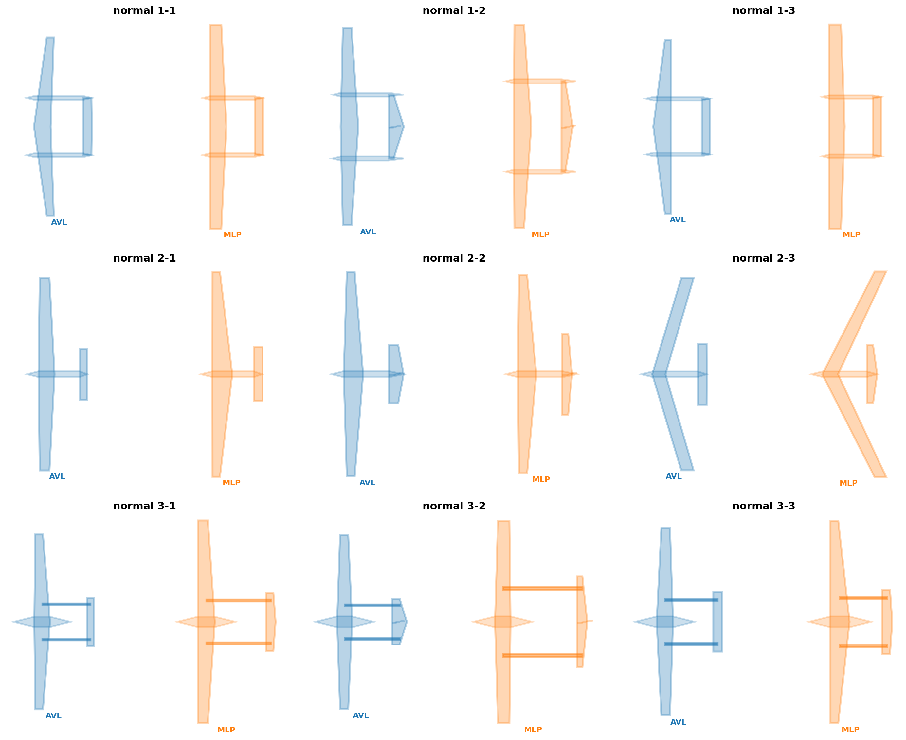
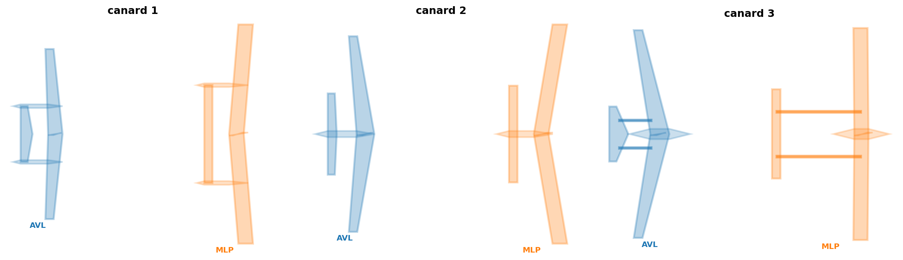

# Original12 qT Optimization with Internal Trim and S_ref from m0/p0

This repository contains the old-branch `qT` Logic 1 optimization workflow with batched MLP prediction and pitch-damping penalty.

Main settings:

```text
NEW20_OBJECTIVE=q_g_per_ton_km
NEW20_MISSION_L_KM=3000
NEW20_FIXED_H=500
NEW20_FIXEDPOINT=0
NEW20_ENABLE_M0_FEEDBACK=1
NEW20_PENALIZE_MZ_OMEGAZ=1
NEW20_MIN_MZ_OMEGAZ=-20
NEW20_MLP_BATCH=1
```

The aerodynamic backend uses the updated old-branch 300k normal/duck MLP models. AVL remains available as the reference backend.

## Run

```bat
run_mlp_10cores.bat
run_avl_10cores.bat
```

## Results Included

Full generation logs are not committed because they are large. The repository includes final best-by-branch summaries and topview visualizations:

- `analysis_oldbranch_qt_damp20/qt_mlp_best_by_branch.csv`
- `analysis_oldbranch_qt_damp20/qt_avl_best_by_branch.csv`
- `analysis_oldbranch_qt_damp20/oldbranch_damp20_mean_summary.csv`

### Topview




