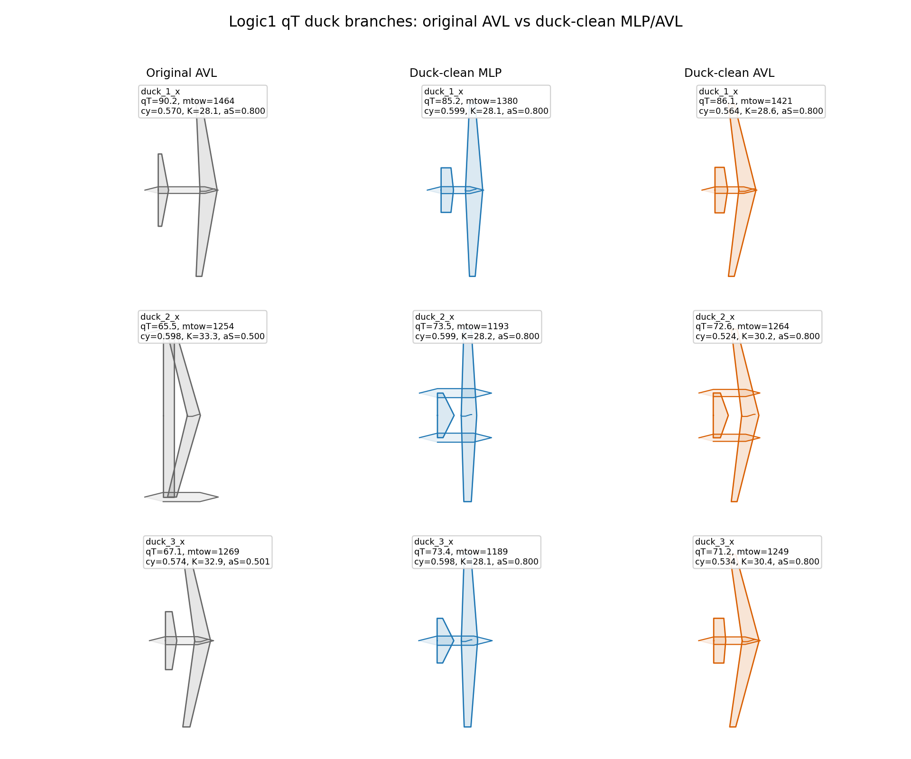

# Original12 qT Optimization with Internal Trim and S_ref from m0/p0

This repository contains the `qT` mission optimization bundle for the `original12`
branch set.

Important: this is not the older per-candidate mass fixed-point workflow. In this
logic, each candidate carries `m0` and `p0`; the optimizer derives:

```text
S_ref = m0 / p0
cy_req = 9.81 * p0 / q
```

Then the evaluator solves internal cruise trim for `alpha` and `delta`. The batch
files set `NEW20_FIXEDPOINT=0`.

## Optimization Inputs

The active design vector has 20 variables:

```text
f_aspect, f_sweep, f_taper, f_twist,
a_aspect, a_sweep, a_taper, a_twist, a_x_loc, a_S_rel,
v_aspect, v_S_rel,
scheme_fuse, scheme_vertical, a_dihedral_mag, margin,
m0, V, H, p0
```

`S_ref` and `cy_req` are not independent random inputs in this bundle.

## Branch Definition

Normal branches keep the original `a_S_rel` range:

```text
normal_*: a_S_rel = 0.2..0.5
```

Duck/canard branches are constrained to a clearer canard layout:

```text
duck_*: a_S_rel = 0.6..0.8
```

The bundled `init_h500` populations were regenerated after this change. A quick
range check gives:

```text
normal_1_1: a_S_rel 0.2002..0.4989
normal_2_2: a_S_rel 0.2007..0.4983
duck_1_x : a_S_rel 0.6001..0.7990
duck_2_x : a_S_rel 0.6009..0.7990
duck_3_x : a_S_rel 0.6010..0.7986
```

## Run

Use a Windows environment with the same dependencies used by the local
`vsppytools` setup.

```bat
run_mlp_10cores.bat
run_avl_10cores.bat
```

or run MLP first, then AVL:

```bat
run_all_10cores.bat
```

Main settings:

```text
NEW20_OBJECTIVE=q_g_per_ton_km
NEW20_MISSION_L_KM=3000
NEW20_FIXED_H=500
NEW20_FIXEDPOINT=0
NEW20_ENABLE_M0_FEEDBACK=1
SHADE_MAX_GENERATIONS=0
BRANCH_N_PER_BRANCH=140
```

Bundled MLP model folders are intentionally limited to the two models used by
the batch files:

```text
models/aero_mlp_original12_normal_qkhead_300k_hard40k
models/aero_mlp_original12_duck_qkhead_300k_hard40k
```

`SHADE_MAX_GENERATIONS=0` means physical/convergence stopping controls the run
rather than a fixed generation cap.

## Topview

The top-view figures below show the duck/canard branches after constraining
`a_S_rel >= 0.6`. They are included only as geometry visuals, not as a recheck
or performance-evidence section.



Per-branch views:

- [`duck_1_x`](topview_duck_asrel60_80_20260616/top_view_by_branch/duck_1_x_topview_original_vs_duck_asrel60_80.png)
- [`duck_2_x`](topview_duck_asrel60_80_20260616/top_view_by_branch/duck_2_x_topview_original_vs_duck_asrel60_80.png)
- [`duck_3_x`](topview_duck_asrel60_80_20260616/top_view_by_branch/duck_3_x_topview_original_vs_duck_asrel60_80.png)

## Repository Hygiene

This tree intentionally does not include the old `topview_fixedpoint_partial`
gallery or `mlp_portable`/`avl_portable` fixed-point bundles. Those belonged to
the older fixed-point repository and should not be used to interpret this qT
logic1 bundle.
