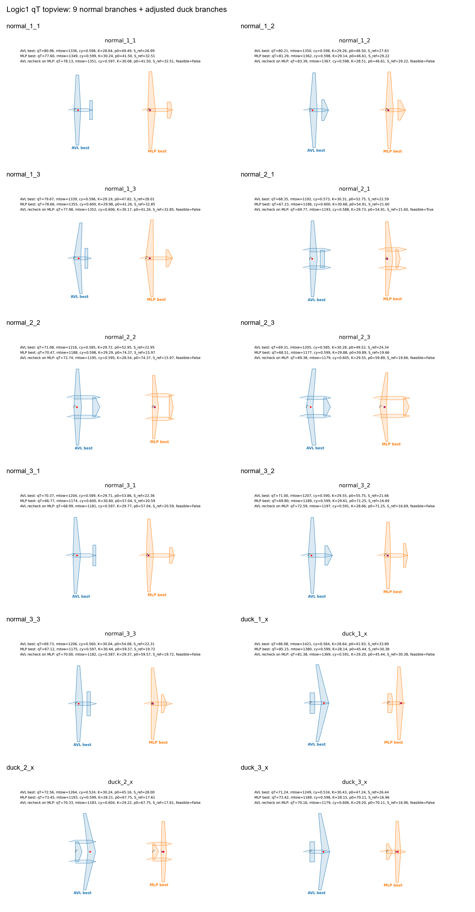

# Original12 qT Optimization with Internal Trim and S_ref from m0/p0

This repository contains the `qT` mission optimization bundle for the `original12`
branch set.

Important: this is not the older per-candidate mass fixed-point workflow. In this
logic, each candidate carries `m0` and `p0`; the optimizer derives:

```text
S_ref = m0 / p0
cy_req = 9.81 * p0 / q
```

Then the evaluator solves internal cruise trim for `alpha` and `delta`. The batch
files set `NEW20_FIXEDPOINT=0`.

## Optimization Inputs

The active design vector has 20 variables:

```text
f_aspect, f_sweep, f_taper, f_twist,
a_aspect, a_sweep, a_taper, a_twist, a_x_loc, a_S_rel,
v_aspect, v_S_rel,
scheme_fuse, scheme_vertical, a_dihedral_mag, margin,
m0, V, H, p0
```

`S_ref` and `cy_req` are not independent random inputs in this bundle.

## Branch Definition

Normal branches keep the original `a_S_rel` range:

```text
normal_*: a_S_rel = 0.2..0.5
```

Duck/canard branches are constrained to a clearer canard layout:

```text
duck_*: a_S_rel = 0.6..0.8
```

The bundled `init_h500` populations were regenerated after this change. A quick
range check gives:

```text
normal_1_1: a_S_rel 0.2002..0.4989
normal_2_2: a_S_rel 0.2007..0.4983
duck_1_x : a_S_rel 0.6001..0.7990
duck_2_x : a_S_rel 0.6009..0.7990
duck_3_x : a_S_rel 0.6010..0.7986
```

## Run

Use a Windows environment with the same dependencies used by the local
`vsppytools` setup.

```bat
run_mlp_10cores.bat
run_avl_10cores.bat
```

or run MLP first, then AVL:

```bat
run_all_10cores.bat
```

Main settings:

```text
NEW20_OBJECTIVE=q_g_per_ton_km
NEW20_MISSION_L_KM=3000
NEW20_FIXED_H=500
NEW20_FIXEDPOINT=0
NEW20_ENABLE_M0_FEEDBACK=1
SHADE_MAX_GENERATIONS=0
BRANCH_N_PER_BRANCH=140
```

Bundled MLP model folders are intentionally limited to the two models used by
the batch files:

```text
models/aero_mlp_original12_normal_qkhead_300k_hard40k
models/aero_mlp_original12_duck_qkhead_300k_hard40k
```

`SHADE_MAX_GENERATIONS=0` means physical/convergence stopping controls the run
rather than a fixed generation cap.


## Batch MLP Speed

The MLP backend now uses batched surrogate prediction inside the trim and aerodynamic evaluation path. This is an implementation-level acceleration only: the design vector, `S_ref = m0 / p0` sizing logic, internal trim equations, and `q_g_per_ton_km` objective are unchanged.

Measured on the 12-branch qT Logic 1 case:

```text
qT AVL Logic 1 baseline   : 32.199 h / 12 branches
qT MLP batch workflow     :  2.442 h / 12 branches
Speed-up vs AVL baseline  : 13.2x
Runtime reduction         : 92.4%
```

A separate qT MLP run with the additional `D_omega_z <= -10` damping constraint took 2.339 h for 12 branches, corresponding to about 13.8x speed-up versus the same AVL baseline. That damping-constrained result is reported separately because it adds a design constraint rather than being a pure batch-only timing comparison.

## Topview

The repository includes the final 12-branch topview gallery:

- Full grid: `analysis_logic1_qt_avl_recheck_branch_compare/topview_grid.png`
- Per-branch views: `analysis_logic1_qt_avl_recheck_branch_compare/top_view_by_branch/`
- Summary CSV: `analysis_logic1_qt_avl_recheck_branch_compare/logic1_qt_branch_compare_summary.csv`

The gallery keeps the 9 normal branches from the previous qT analysis and uses
the adjusted duck/canard branches with `a_S_rel >= 0.6` as the final duck
configuration.

Preview:



## Repository Hygiene

This tree intentionally does not include the old `topview_fixedpoint_partial`
gallery or `mlp_portable`/`avl_portable` fixed-point bundles. Those belonged to
the older fixed-point repository and should not be used to interpret this qT
logic1 bundle.
